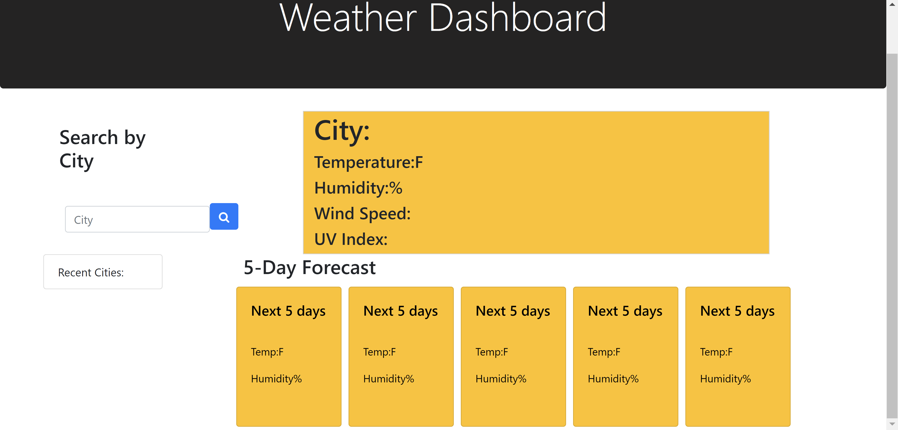

# Weather App

## Overview

This is an app where you can type in any city, and you get the temperature, humidity, wind speed, and UV index for the day. As well, you get the 5 day forecast for the city.

## Description

This app is made in jquery.The main focus on this app is the Ajax calls for open weather API. There are 3 different calls being used in this application. One call to get today's weather, one call to get the five day forecast, and another call to get the UV Index.

### Application

